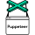

<table><tr><td valign="top" width="33%" align="center">

### Frontend

</td><td valign="top" width="34%" align="center">

### Other

</td><td valign="top" width="33%" align="center">

### Backend

</td></tr><tr><td valign="top" width="33%" align="center">

<!-- Frontend -->

### Learning next

</td><td valign="top" width="34%" align="center">

<!-- Other -->

### Learning next

</td><td valign="top" width="33%" align="center">

<!-- Backend -->

### Learning next

</td></tr></table>
